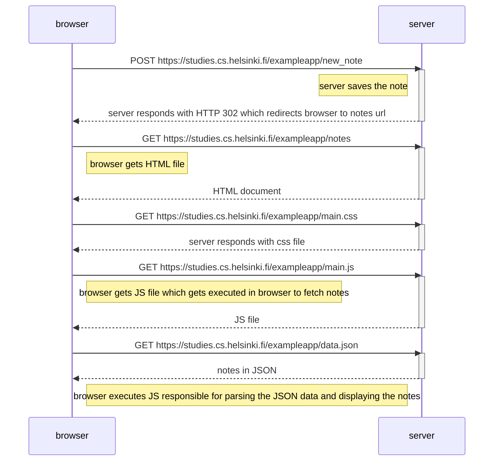

```mermaid
sequenceDiagram
    participant browser
    participant server

    browser->>server: POST https://studies.cs.helsinki.fi/exampleapp/new_note
    activate server
    Note left of server: server saves the note

    server-->>browser: server responds with HTTP 302 which redirects browser to notes url
    deactivate server

    browser->>server: GET https://studies.cs.helsinki.fi/exampleapp/notes
    activate server

     Note right of browser: browser gets HTML file
    server-->>browser: HTML document
    deactivate server

    browser->>server: GET https://studies.cs.helsinki.fi/exampleapp/main.css
    activate server

    server-->>browser: server responds with css file
    deactivate server

    browser->>server: GET https://studies.cs.helsinki.fi/exampleapp/main.js

    activate server
    Note right of browser: browser gets JS file which gets executed in browser to fetch notes
    server-->>browser: JS file
    deactivate server

    browser->>server: GET https://studies.cs.helsinki.fi/exampleapp/data.json
    activate server

    server-->>browser: notes in JSON
    deactivate server

    Note right of browser: browser executes JS responsible for parsing the JSON data and displaying the notes
```
