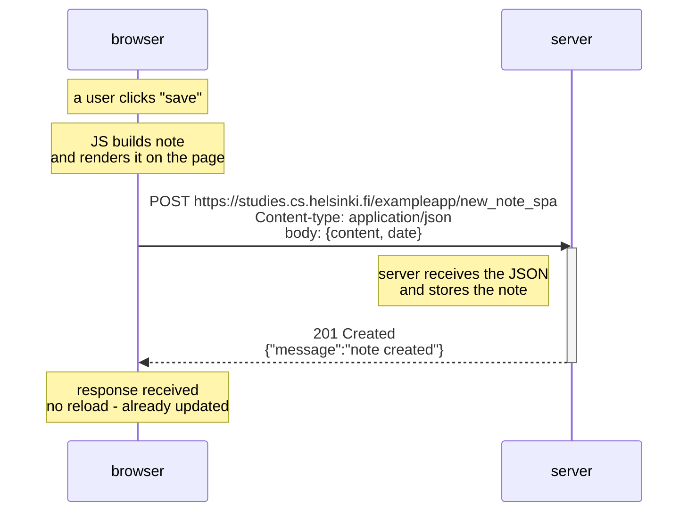

```mermaid
sequenceDiagram
    participant browser
    participant server

    Note over browser: a user clicks "save"
    Note over browser: JS builds note <br> and renders it on the page
    browser->>server: POST https://studies.cs.helsinki.fi/exampleapp/new_note_spa <br> Content-type: application/json <br> body: {content, date}


    activate server
    Note left of server: server receives the JSON <br> and stores the note

    server-->>browser: 201 Created <br> {"message":"note created"}
    deactivate server

    Note over browser: response received <br> no reload - already updated
```
